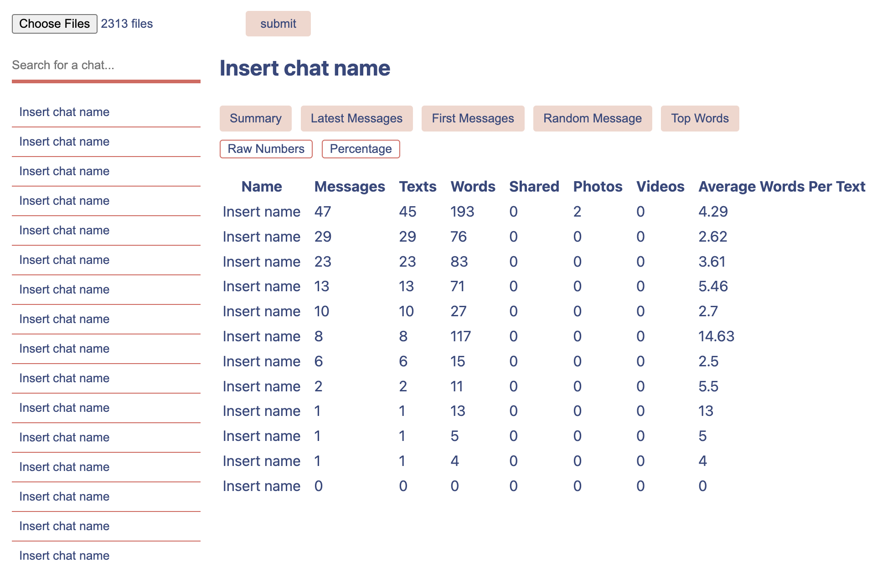

# Instagram DM Analyzer
This webapp generates metrics (and some other things like random messages) based on your Instagram direct messages.

Check it out [here](https://jenetic.github.io/instagram-dm-analyzer/)!

 

## Built With
This was built with TypeScript, HTML, and CSS.

## Development
```shell
# Install dependencies
$ npm install

# Run development server
$ npm run dev

# Bundle files for production
$ npm run build

# Deploy
$ npm run deploy
```
